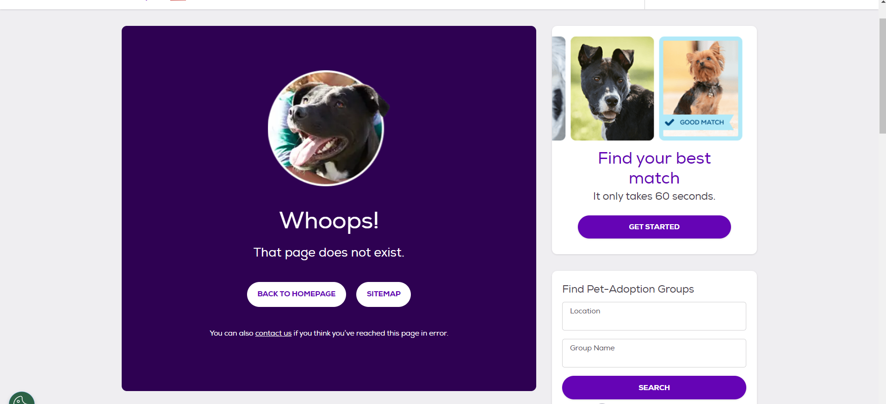
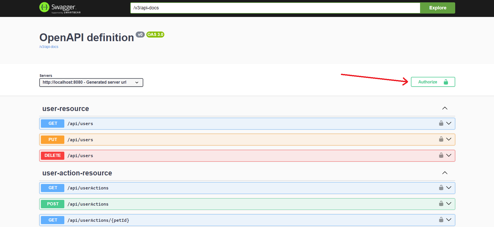
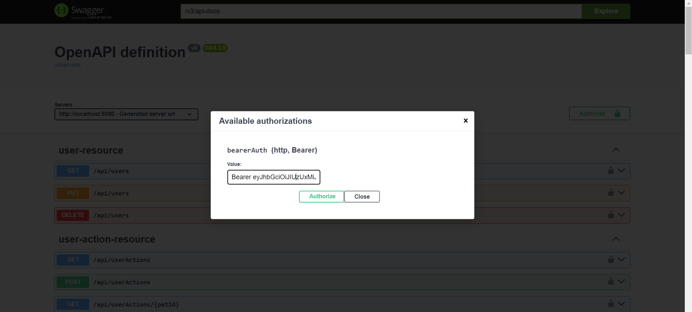

# Pets Finder App

## Overview

The Pets Finder App is a Java Spring Boot application that enables users to interact with dog profiles. The application was intended to integrate the PetFinder API to retrieve dog details, but due to issues with obtaining an API key (the access key page is currently disabled), the app uses mocked data instead. Users can like or dislike dog profiles through a responsive interface.

## Features



- **API Integration**: Initially intended to fetch pet profiles using the PetFinder API. Currently, the app uses mocked data for pet profiles including images, names, and other details because the PetFinder.com/developers page for creating API keys is currently inaccessible.
- **User Interaction**: Support for liking or disliking pet profiles.
- **Database Management**: Maintain a record of user interactions with pet profiles.

- ##### **Testing environment**: You can test full functionality with only swagger-documentation.

    
    1. First Create user with signup
    2. Get accessToken by signin
    3. Then click `Authorize` button on the top.

    

    4. Copy the access token and do `Authorize` by pasting into authorization value input.

    

    5. Now you can get full access to all functionalities.
    


## Technologies Used

- Java 17
- Spring Boot 5.7
- PostgreSQL
- Gradle

## Getting Started

### Prerequisites

- JDK 17
- Gradle 8.x or later
- PostgreSQL

### Setup and Installation

1. Clone the repository:

    ```
    git clone https://github.com/git-dru/pets-Finder-app.git
    ```

2. Navigate to the project directory:

    ```
    cd pets-Finder-app
    ```
3. Adjust .env file to as your need.

4. Run with Java dev tools or vscode extension. (for dev purpose)

5. After starting the application it is accessible under http://localhost:8080.

5. ##### Access API documentation created by Swagger under http://localhost:8080/swagger-ui/index.html.


## API Endpoints

### Authentication

- **POST /api/auth/signin** - Authenticate users and return a JWT.
- **POST /api/auth/signup** - Register a new user.

### Animals

- **GET /api/animals** - Retrieve all animal profiles (mock data).
- **GET /api/animals/{id}** - Retrieve a specific animal profile by ID (mock data).

### Breeds

- **GET /api/breeds** - Fetch all available breeds (mock data).

### Organizations

- **GET /api/organizations** - List all organizations (mock data).
- **GET /api/organizations/{id}** - Get details of a specific organization (mock data).

### Types

- **GET /api/types** - List all types of entities (mock data).
- **GET /api/types/{type}** - Get details for a specific type (mock data).

### User Actions

- **GET /api/userActions** - Retrieve all actions made by the authenticated user.
- **POST /api/userActions** - Log an action made by a user on a pet profile.
- **DELETE /api/userActions/{petId}** - Delete a specific action made by the user.

### Users

- GET **/api/users** - Retrieve the authenticated user's profile.
- PUT **/api/users** - Update the authenticated user's profile.
- **DELETE /api/users** - Delete the authenticated user's profile.

## Folder Structure

    PET FINDER/
    │
    ├── .gradle/
    ├── .vscode/
    ├── bin/
    ├── gradle/
    ├── src/
    │   ├── main/
    │   │   ├── java/
    │   │   │   └── pet/
    │   │   │       └── finder/
    │   │   │           └── petfinder/
    │   │   │               ├── config/
    │   │   │               ├── domain/
    │   │   │               ├── enums/
    │   │   │               ├── model/
    │   │   │               ├── repos/
    │   │   │               ├── rest/
    │   │   │               ├── service/
    │   │   │               └── util/
    │   │   └── resources/
    │   │       └── mockResponse/
    │   │       └── application.yml
    │   └── test/
    ├── build.gradle
    ├── gradlew
    ├── gradlew.bat
    ├── README.md
    └── settings.gradle

## Configuration

- Modify `.env` to adjust database settings.
